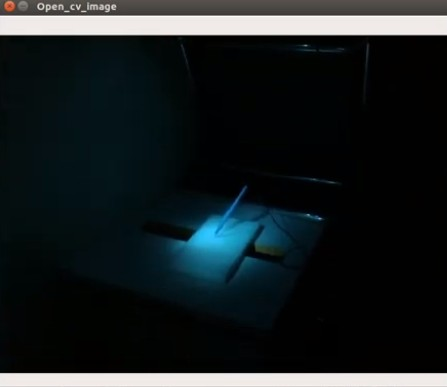
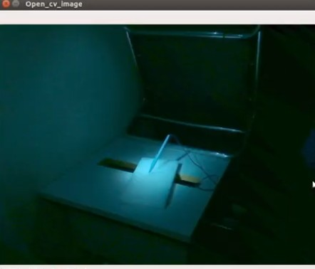
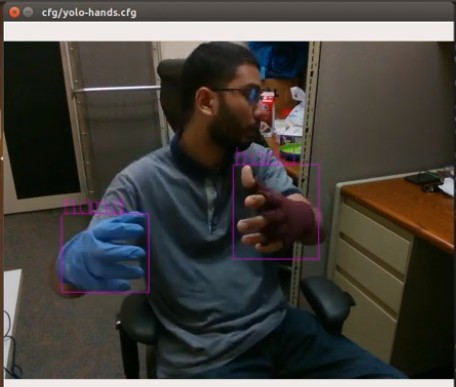
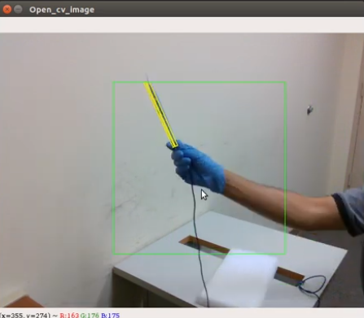
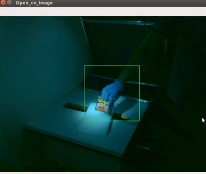

## Introduction
In this repository I have combined three functionalities to detect pose
of target objects held by hand in dark. Please watch my
[demo video](https://youtu.be/XwVy5sZZxG8) for more details.

Following are the repositories/ideas I have relied on:
1. I have used DOPE
   [(Deep Object Pose Estimation)](https://github.com/NVlabs/Deep_Object_Pose)
   for tracking object pose.
2. YOLO2 PyTorch impelementation by marvis
   ([pytorch-yolo2](https://github.com/marvis/pytorch-yolo2)) for
   tracking hands wearing gloves.
3. Gamma correction using OpenCV
   ([Link](https://www.pyimagesearch.com/2015/10/05/opencv-gamma-correction/))
   for processing dark/low-exposure frames.

### Problem Description
My objective in this project is to detect a medical tool called a
cautery in surgical lighting. A cautery is a electronic knife like tool
that looks like a pen. It is used to make cuts during surgery and is a
very extensively used tool.

 

 

As part of my research on Augmented Surgical Reality, I investigate the
usability of existing 6DoF object pose estimation methods such as Deep
Object Pose Estimation
[(DOPE)](https://github.com/NVlabs/Deep_Object_Pose) and Single Shot
Pose [(SSP)](https://github.com/microsoft/singleshotpose) for cautery
tool detection. After applying DOPE and SSP, I realized that the cautery
is a very difficult object to track for multiple reasons. Most important
reasons are: the cautery is very small and thin, featureless, is bound
to be heavily occluded. One other problem that is unique to Operation
Room environment only, is the high-intensity surgical lighting above. To
handle this I tried lowering the exposure of the camera. However, due to
such high intensity of the lighting the exposure has to be lowered to
such a low level that neither YOLO2 nor DOPE is able to detect anything
[(DOPE in extreme lighting demo video)](https://youtu.be/rf-Hnc4QBsk).
This all makes it very challenging to track a cautery pen in operation
room like environment.

In order to overcome these problems in this project, I tried out merging
3 different methods. To rectify the dark image (due to low exposure
settings of camera) I added a gamma correction methods which makes the
image brigher. Following are two captured images before and after the
gamma correction respectively. Notice how the image gets brigher after
gamma correction. The performance jump due to gamma correction is very
clear. [A demonstraion of the gammar correction and how
it helps tracking hands in the dark is demonstrated in this video](https://youtu.be/Khy8U_zXDC4).

 

I trained YOLO2 to track hands. Follwoing is a demo image of hand
tracking using YOLO2. I trained my own weights for hand tracking instead
of using the existing hand-trackers. That is because **existing
hand-trackers track only bare hands without gloves**. If there are
gloves, then the trackers fail. My tracker can work with different
colored hands and will different gloves.

Finally, I take a cropped square image around the hand which is then run
through DOPE to identify the pose of the pen. The operation speed of
DOPE increases according to the size of selected crop size around the
detected hand. DOPE with hand tracking looks like the following image in
normal lighting. The green box is centered at the detected hand and the
portion inside the green box is being cropped. The yellow 3D bounding
box shows the detected pose of the target object. 
  

### Conclusion
After my experiments, I realized that I lacked proper dataset to train
DOPE for being able to detect objects in the dark. I demostrate that
using the following image where I try to detect the well known
[ycb-object](http://www.ycbbenchmarks.com/object-models/) 'spam can'. I
used the original weights provided by the authors of DOPE but still DOPE
was not able to detect the can even with the help of hand detection.
This is because the lighting condition used by the authors are not as
extreme as mine( Please take a look at the
[Falling Objects dataset](https://research.nvidia.com/publication/2018-06_Falling-Things)).
Currently I am working on making better dataset.

## Downloads
I uploaded the necessary weights in my
[Dropbox](https://www.dropbox.com/sh/hv44h3v1zc21a2q/AADSNSIWrtf__8yKpqZnEUC4a?dl=0).

Put the 'backup' folder in the project direcory. 

## Installation
Please follow instructions for
[DOPE](https://github.com/NVlabs/Deep_Object_Pose).

The original pytorch-yolo2 was workable only with PyTorch version 0.3.1.
I have changed the codes so that it can work with 0.4.0 which DOPE uses. 

## Usage:
I have used an Intel Realsense D435i camera for this implementation as I
needed to control exposure.

live_dope_hand_realsense.py is the final impelmentation. In the code
change the "Settings" section if needed. Please watch my
[demo video](https://youtu.be/XwVy5sZZxG8) for more details.

live_dope_realsense.py and live_dope_webcam.py are just DOPE demos using
the realsense camera and webcam respectively. The original DOPE demos
are using ROS. I needed a smipler demo so I made these two.

